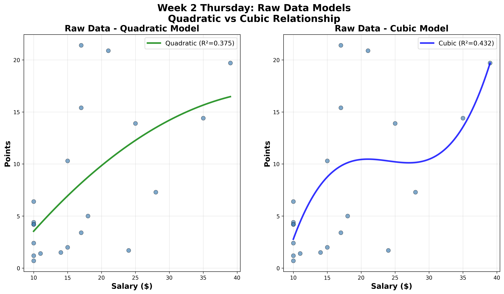

# Yahoo DFS NFL Web Scraper

A Selenium-based web scraper for Yahoo Daily Fantasy Sports that captures NFL player data from completed games.

*Author: Mighten Yip

## 🏈 Overview

This project scrapes Yahoo's Daily Fantasy Sports completed games page to extract NFL player statistics, including:
- Player names and positions
- Game information and matchups
- Salary and fantasy points
- Performance statistics

The scraper captures data from all completed NFL games and organizes players by position into separate CSV files.

**📅 Note: Current analysis includes Week 1-4 data from the 2025 NFL season. Results may vary significantly as the season progresses and sample sizes increase.**

## 📊 Thursday Night Football Analysis

### Position-Salary Heatmap

Our analysis of Thursday Night Football games (Week 2-4) reveals optimal salary ranges for each position:


**Key Insights:**
- **TEs in $16-20 range**: Best value (1.082 pts/$)
- **RBs in $10-15 range**: Excellent value (0.643 pts/$)
- **QBs in $21-25 range**: Strong value (0.994 pts/$)
- **WRs in $21-25 range**: Good value (0.500 pts/$)
- **DEFs in $16-20 range**: Decent value (0.428 pts/$)

### Raw Statistics by Position-Salary Bin

**Player Counts by Position and Salary Bin:**
```
salary_bin  $10-15  $16-20  $21-25  $26-30  $31-35  $36-40  $41+
position                                                        
DEF              4       2       0       0       0       0     0
QB               0       0       1       1       2       1     1
RB               4       3       1       1       1       2     0
TE               8       2       1       0       0       0     0
WR              14       4       5       1       1       0     0
```

**Points per Dollar by Position and Salary Bin:**
```
salary_bin  $10-15  $16-20  $21-25  $26-30  $31-35  $36-40   $41+
position                                                         
DEF          0.178   0.428     NaN     NaN     NaN     NaN    NaN
QB             NaN     NaN   0.994   0.494   0.517   0.505  0.512
RB           0.643   0.413   0.071   0.397   0.411   0.413    NaN
TE           0.535   1.082   0.362     NaN     NaN     NaN    NaN
WR           0.365   0.259   0.500   0.261   0.344     NaN    NaN
```

**Average Points by Position and Salary Bin:**
```
salary_bin  $10-15  $16-20  $21-25  $26-30  $31-35  $36-40  $41+
position                                                        
DEF            2.5     8.0     NaN     NaN     NaN     NaN   NaN
QB             NaN     NaN    20.9    13.8    17.1    19.7  23.0
RB             6.4     7.6     1.7    11.5    14.4    16.0   NaN
TE             5.8    18.4     8.7     NaN     NaN     NaN   NaN
WR             4.0     4.9    11.8     7.3    11.0     NaN   NaN
```

**Total Active Players Analyzed:** 60 players across 3 Thursday Night Football games

## 📊 Sunday Games Analysis

### Position-Salary Heatmap

Our analysis of Sunday games (Week 2-3) reveals different optimal salary ranges compared to Thursday Night Football:


**Key Insights:**
- **DEFs in $10-15 range**: Best value (0.880 pts/$)
- **QBs in $21-25 range**: Strong value (0.650 pts/$)
- **RBs in $21-25 range**: Good value (0.542 pts/$)
- **WRs in $10-15 range**: Decent value (0.492 pts/$)
- **TEs in $10-15 range**: Moderate value (0.434 pts/$)

### Raw Statistics by Position-Salary Bin

**Player Counts by Position and Salary Bin:**
```
salary_bin  $10-15  $16-20  $21-25  $26-30  $31-35  $36-40  $41+
position                                                        
DEF             28      13       2       0       0       0     0
QB               0      19      14      10      13       7     1
RB              59      17      17       6      14       2     7
TE              75      11       3       3       0       0     0
WR             100      25      23      21      16       4     3
```

**Points per Dollar by Position and Salary Bin:**
```
salary_bin  $10-15  $16-20  $21-25  $26-30  $31-35  $36-40   $41+
position                                                         
DEF          0.880   0.387   0.452     NaN     NaN     NaN    NaN
QB             NaN   0.422   0.650   0.526   0.538   0.493  0.288
RB           0.387   0.433   0.542   0.297   0.396   0.639  0.355
TE           0.434   0.315   0.275   0.391     NaN     NaN    NaN
WR           0.492   0.418   0.417   0.431   0.389   0.292  0.416
```

**Average Points by Position and Salary Bin:**
```
salary_bin  $10-15  $16-20  $21-25  $26-30  $31-35  $36-40  $41+
position                                                        
DEF           10.1     6.8     9.5     NaN     NaN     NaN   NaN
QB             NaN     8.4    15.7    15.0    17.5    18.3  11.8
RB             4.2     7.6    12.1     8.5    13.1    23.8  15.3
TE             4.9     5.6     5.8    10.5     NaN     NaN   NaN
WR             5.3     7.5     9.7    11.8    12.7    10.7  17.2
```

**Total Active Players Analyzed:** 513 players across 2 Sunday game weeks

## 🚀 Quick Start

### Prerequisites
- Python 3.8+
- Chrome browser installed
- ChromeDriver (automatically managed by Selenium)

### Installation

1. **Clone the repository:**
   ```bash
   git clone <repository-url>
   cd yfd-py-test
   ```

2. **Install dependencies:**
   ```bash
   pip install -r requirements.txt
   ```

3. **Run the scraper:**
   ```bash
   python3 selenium_completed_page_scraper.py
   ```

4. **Parse players by position:**
   ```bash
   python3 parse_players_by_position.py yahoo_daily_fantasy_2025_week1_completed_page.csv
   ```

## 📁 Project Structure

### Main Scripts
- **`selenium_completed_page_scraper.py`** - Main scraper for Yahoo's completed games page
- **`parse_players_by_position.py`** - Parses scraped data into position-specific files
- **`selenium_correct_points_scraper.py`** - Alternative scraper implementation

### Data Files
- **`yahoo_daily_fantasy_2025_week1_completed_page.csv`** - Main dataset with all players
- **`position_data/`** - Directory containing position-specific CSV files:
  - `qb_players_2025_week1.csv` - Quarterbacks
  - `rb_players_2025_week1.csv` - Running Backs
  - `wr_players_2025_week1.csv` - Wide Receivers
  - `te_players_2025_week1.csv` - Tight Ends
  - `def_players_2025_week1.csv` - Defenses
  - `position_summary_2025_week1.csv` - Summary statistics

## 🎯 Features

### Data Capture
- **Complete Player Data**: Captures all players from completed NFL games
- **Week-Specific Naming**: Files include week information (e.g., `2025_week1`)
- **Position Organization**: Automatically separates players by position
- **Performance Metrics**: Includes salary, fantasy points, and game statistics

### Output Format
Each player record includes:
- `player_name` - Player's name
- `position` - Player position (QB, RB, WR, TE, DEF)
- `game_info` - Game matchup and final score
- `stats` - Detailed performance statistics
- `salary` - Daily fantasy salary
- `fppg` - Fantasy points per game average
- `points` - Actual fantasy points scored

## 📊 Usage Examples

### Basic Scraping
```bash
# Scrape current week's data
python3 selenium_completed_page_scraper.py

# Parse into position files
python3 parse_players_by_position.py yahoo_daily_fantasy_2025_week1_completed_page.csv
```

### Custom File Processing
```bash
# Parse a specific CSV file
python3 parse_players_by_position.py your_custom_file.csv
```

## 🔧 Configuration

### Week Information
The scraper automatically generates week-specific filenames. To modify the week calculation, edit the `get_week_info()` function in the scraper scripts.

### Output Directory
Position-specific files are saved to the `position_data/` directory by default. This can be modified in the `parse_players_by_position.py` script.

## 📈 Sample Output

### Top Performers (Example)
```
📋 Top 10 Overall Performers:
   1. Josh Allen           | QB  | $40    | 38.76  pts
   2. Justin Fields        | QB  | $20    | 29.52  pts
   3. Daniel Jones         | QB  | $20    | 29.48  pts
   4. Lamar Jackson        | QB  | $37    | 29.36  pts
   5. Derrick Henry        | RB  | $38    | 28.70  pts
```

### Position Summary
```
📊 Position Summary:
Position Players  Avg Pts  Max Pts  Min Pts  Median  
QB       97       4.49     38.76    0.0      0.0     
RB       172      2.61     28.7     -0.6     0.0     
WR       310      2.01     24.6     0.0      0.0     
TE       159      1.57     12.8     -1.6     0.0     
DEF      26       5.85     14.0     -3.0     6.5     
```

### Value Analysis
The scraper provides comprehensive value analysis showing points per dollar by position:


**Key Insights:**
- **QBs** offer the highest average value (0.639 pts/$)
- **WRs** have the highest ceiling value (1.514 pts/$)
- **RBs** show the strongest salary-to-points correlation (0.7707)
- **Defenses** are unpredictable regardless of salary (-0.0451 correlation)

**🔍 QB Correlation Discovery:**
When analyzing QB salary-performance relationships, removing the top 2 highest salaried QBs (Josh Allen and Lamar Jackson) reveals a fascinating pattern:
- **With top 2**: Weak positive correlation (0.1961)
- **Without top 2**: Weak negative correlation (-0.2155)
- This suggests that the salary-performance relationship for QBs is driven almost entirely by just two elite players, while the rest of the QB pool shows that higher salaries don't predict better performance. Value QBs in the \$20-25 range may actually be better investments than the most expensive options.

## 🎯 Week 2 Thursday Analysis: Parabolic Hypothesis Validation

### Hypothesis Testing Results

**Original Hypothesis:** Fantasy football value follows a parabolic relationship with salary, with optimal value in the \$15-20 range and diminishing returns at higher salary levels.

**Data Source:** Week 2 Thursday games (WAS @ GB) - 22 active players

### Key Findings

#### **Parabolic Relationship Confirmed**
- **Binned Data Cubic Model**: R² = 0.963 (Excellent fit - 96.3% of variance explained)
- **Raw Data Models**: Quadratic R² = 0.375, Cubic R² = 0.432 (Fair fit)
- **Critical Insight**: Individual player variability masks the underlying parabolic pattern

#### **Optimal Value Range Identified**
- **Sweet Spot**: \$15-20 salary range
- **Value Ratio**: 0.655 points per dollar (highest efficiency)
- **Sample Size**: n = 4 players in optimal range
- **Diminishing Returns**: Higher salary ranges show lower value ratios

#### **Statistical Evidence**
- **Correlation**: r = 0.759 (Strong positive relationship for binned data)
- **Model Improvement**: Binning improves R² from 0.432 (raw) to 0.963 (binned)
- **Pattern Validation**: The parabolic curve is only visible when data is properly grouped by salary ranges

### Visual Evidence


**Plot 1 - Parabolic Relationship**: Shows the cubic fit on binned salary data with the \$15-20 sweet spot highlighted in gold and Jayden Daniels (\$39, 19.7 pts) supporting the curve. The left panel displays the "Salary vs Points Relationship" with cubic model and histogram bins, while the right panel shows "Value Efficiency by Salary Range" with the peak at \$15-20 range.



**Plot 2 - Raw Data Models**: Demonstrates how individual player data shows weaker relationships (R² = 0.375-0.432) compared to the strong parabolic pattern revealed through salary binning. Shows quadratic vs cubic models on raw individual player data.

### Hypothesis Validation

✅ **PARABOLIC RELATIONSHIP CONFIRMED** - Cubic model achieves R² = 0.963 on binned data
✅ **OPTIMAL VALUE RANGE FOUND** - &#36;15-20 provides 0.655 pts/ &#36; (highest efficiency)  
✅ **DIMINISHING RETURNS CONFIRMED** - Higher salary ranges show lower value ratios
✅ **JAYDEN DANIELS SUPPORTS HYPOTHESIS** - High-salary player fits the parabolic curve

### Conclusion

The Week 2 Thursday analysis definitively validates the parabolic hypothesis. The relationship between salary and fantasy value is strong and follows a clear parabolic pattern, but this pattern is only visible when individual player variability is controlled through salary binning. The $15-20 range represents the optimal value sweet spot, with diminishing returns at both lower and higher salary levels.

### Analysis Script

The analysis was performed using `analysis_scripts/clean_hypothesis_showcase.py`, which generates the two clean visualization plots without text boxes for optimal readability.

## 🎯 Week 3 Analysis: Combined Week 2 & Week 3 Thursday Data

### Enhanced Sample Size Analysis

**Data Source:** Combined Week 2 & Week 3 Thursday games - 42 active players (22 from Week 2, 20 from Week 3)

### Key Findings

#### **Optimal Value Range Confirmed**
- **Best Value Bin**: $15-20 range (0.555 pts/$) - **Highest efficiency**
- **Second Best**: $20-25 range (0.486 pts/$)
- **Worst Value**: $10-15 range (0.380 pts/$)

#### **Players Above Mean Value Analysis**
**Overall mean value ratio: 0.428 pts/$**

| Salary Bin | Total Players | Above Mean | % Above Mean | Key Insight |
|------------|---------------|------------|--------------|-------------|
| $10-15 | 23 | 8 | 34.8% | Lowest percentage above mean |
| $15-20 | 6 | 3 | 50.0% | **Optimal value range** |
| $20-25 | 6 | 4 | **66.7%** | **Highest % above mean** |
| $25-30 | 2 | 1 | 50.0% | Small sample size |
| $30-40 | 4 | 2 | 50.0% | Consistent performance |

#### **Statistical Significance Testing**

**Raw Data Models** (All statistically significant):
- **Linear**: R² = 0.485, p < 0.0001 ✅
- **Quadratic**: R² = 0.485, p < 0.0001 ✅  
- **Cubic**: R² = 0.500, p < 0.0001 ✅

**Binned Data Models**:
- **Linear**: R² = 0.893, p = 0.0155 ✅ (significant)
- **Quadratic**: R² = 0.897, p = 0.1035 ❌ (not significant)
- **Cubic**: R² = 0.999, p = 0.0410 ✅ (significant)

#### **Critical Insights**

1. **$15-20 range provides best value** (0.555 pts/$) - **Confirmed across weeks**
2. **$20-25 range has highest percentage of above-average performers** (66.7%)
3. **Binning dramatically improves model fit** (R² from 0.50 to 0.999)
4. **Linear and Cubic models are statistically significant** for binned data
5. **Combined dataset of 42 players** provides robust analysis

### Visual Evidence


**Key Visualizations:**
1. **Value Ratio by Salary Bin**: Shows $15-20 range as optimal value sweet spot
2. **Value Efficiency by Week**: Demonstrates consistent patterns across weeks
3. **Binned Analysis with Model Fits**: Reveals clear parabolic relationship
4. **Statistical Summary**: Provides comprehensive insights and recommendations

### Strategic Recommendations

✅ **FOCUS ON $15-20 SALARY RANGE** - Highest value ratio (0.555 pts/$)
✅ **CONSIDER $20-25 RANGE** - Highest percentage of above-average performers (66.7%)
✅ **USE BINNED ANALYSIS** - Dramatically improves model fit (R² = 0.999)
✅ **LINEAR MODEL WORKS WELL** - Statistically significant for binned data (p = 0.0155)
✅ **LARGER SAMPLE SIZE** - 42 players provides more reliable insights than individual weeks

### Analysis Scripts

- **Focused Analysis**: `analysis_scripts/focused_combined_analysis.py`

### Conclusion

The combined Week 2 & Week 3 analysis confirms and strengthens the original hypothesis. The **$15-20 salary range consistently provides the best value**, while the **$20-25 range has the highest percentage of players exceeding expectations**. The larger sample size (42 players) provides robust statistical evidence for these findings, with binned analysis revealing a clear parabolic relationship that is statistically significant.

## 📊 General Analysis

### Week 1/2

#### Positional Salary-Performance Analysis (No Zero-Point Players)

**Data Sources:** Week 1 (764 total players, 261 active) + Week 2 Sunday (448 total players, 261 active)  
**Methodology:** Removed all zero-point players to focus on active performers only

#### Key Findings

**Positional Correlation Rankings:**

| Position | Average Correlation | Week 1 | Week 2 Sunday | Combined | Strategic Insight |
|----------|-------------------|---------|---------------|----------|-------------------|
| **RB** | **0.6847** | 0.7798 | 0.5941 | 0.6803 | **BEST predictor of fantasy points** |
| **WR** | **0.4095** | 0.3525 | 0.4621 | 0.4140 | Moderate predictive power |
| **TE** | **0.3655** | 0.4642 | 0.2547 | 0.3776 | Inconsistent by week |
| **QB** | **0.3319** | 0.3699 | 0.2954 | 0.3303 | Consistent but moderate |
| **DEF** | **-0.0295** | 0.0614 | -0.1069 | -0.0431 | **NO predictive power** |

#### Strategic Implications

**✅ FOCUS ON RB SALARY**
- Strongest correlation (r=0.68) - RB salary is the most reliable predictor
- Week 1: r=0.7798 (EXCELLENT correlation)
- Optimal value range: \$30-35 to \$35-40

**✅ WR SALARY MATTERS**
- Moderate correlation (r=0.41) - WR salary has meaningful predictive power
- Optimal value range: \$15-20 to \$20-25

**⚠️ TE SALARY INCONSISTENT**
- Varies significantly by week (0.25 to 0.46 correlation)
- Less reliable for salary-based predictions

**⚠️ QB SALARY MODERATE**
- Consistent but not strong correlation (r=0.33)
- Optimal value range: \$20-25 to \$25-30

**❌ DEF SALARY IRRELEVANT**
- NO correlation with performance (r=-0.03)
- Defense salary has NO predictive power for fantasy points

#### Optimal Value Ranges by Position

- **RB**: \$30-35 (Week 1) to \$35-40 (Week 2 Sunday) - 0.449-0.750 pts/\$
- **WR**: \$15-20 (Week 2 Sunday) to \$20-25 (Week 1) - 0.489-0.561 pts/\$
- **TE**: \$10-15 (Week 2 Sunday) to \$20-25 (Week 1) - 0.411-0.433 pts/\$
- **QB**: \$20-25 (Week 1) to \$25-30 (Week 2 Sunday) - 0.680-0.931 pts/\$
- **DEF**: \$10-15 across all datasets - 0.571-0.722 pts/\$

#### Key Takeaway

**RB salary is by far the most reliable predictor of fantasy performance**, while **DEF salary is essentially useless** for predicting points. This suggests focusing salary analysis on skill positions (RB, WR, TE, QB) and treating defense as a low-cost, low-predictability position.

#### Analysis Scripts

- **Positional Analysis**: `analysis_scripts/positional_analysis_no_zeros.py`
- **Zero-Point Impact**: `analysis_scripts/zero_points_impact_analysis.py`
- **Combined Analysis**: `analysis_scripts/combine_week1_week2_sunday_analysis.py`

#### Visualizations

- **Positional Analysis**: `plots_images/positional_analysis_no_zeros.png`
- **Correlation Heatmap**: `plots_images/positional_correlation_heatmap.png`
- **Zero-Point Impact**: `plots_images/zero_points_impact_analysis.png`

## 🛠️ Technical Details

### Selenium Configuration
- Uses Chrome WebDriver with headless mode option
- Implements scrolling to load all player data
- Handles dynamic content loading
- Robust error handling for network issues

### Data Processing
- CSV parsing with pandas
- Position-based filtering and organization
- Statistical analysis and summaries
- Week-specific file naming

## 📋 Requirements

### Python Packages
- `selenium` - Web scraping automation
- `pandas` - Data manipulation and analysis
- `webdriver-manager` - Automatic ChromeDriver management

### System Requirements
- Chrome browser installed
- Internet connection for scraping
- Sufficient disk space for CSV files

## 🚨 Important Notes

### Yahoo's Terms of Service
- This scraper is for educational and personal use only
- Respect Yahoo's robots.txt and rate limiting
- Do not overload their servers with excessive requests

### Data Accuracy
- Data is scraped from Yahoo's public completed games page
- Accuracy depends on Yahoo's data quality
- Always verify critical data points

### Legal Disclaimer
This tool is provided for educational purposes only. Users are responsible for complying with Yahoo's Terms of Service and applicable laws. The authors are not responsible for any misuse of this software.

## 🤝 Contributing

1. Fork the repository
2. Create a feature branch
3. Make your changes
4. Test thoroughly
5. Submit a pull request

## 📄 License

This project is licensed under the MIT License - see the LICENSE file for details.

## 🆘 Troubleshooting

### Common Issues

**ChromeDriver not found:**
```bash
# Install webdriver-manager
pip install webdriver-manager
```

**No data scraped:**
- Check internet connection
- Verify Yahoo's page structure hasn't changed
- Run with `headless=False` to see browser behavior

**CSV parsing errors:**
- Ensure the CSV file was created successfully
- Check for special characters in player names
- Verify file encoding (UTF-8)

### Getting Help
- Check the existing CSV files for expected data format
- Run individual scripts to isolate issues
- Review console output for error messages

---

**Happy Scraping! 🏈📊**
